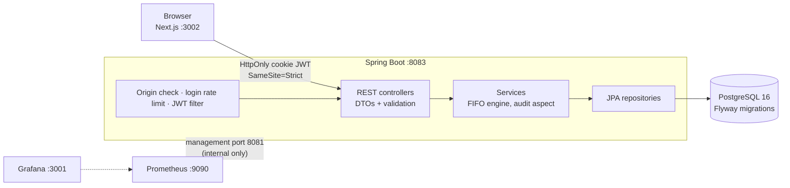

# Warehouse Management System (WMS)

[](https://github.com/eucardeveloper/inventory-management-api/actions/workflows/ci.yml) [](https://github.com/eucardeveloper/inventory-management-api/actions/workflows/frontend.yml)

A warehouse management system (WMS): products, suppliers, FIFO stock lots, stock movements, reports and an audit log. Spring Boot REST API, PostgreSQL, a Next.js dashboard, and Prometheus/Grafana monitoring. Runs locally with one command.

> **Naming:** the product is called *Warehouse Management System (WMS)* everywhere you see it (web app, API docs, this README). Only the GitHub repository (`inventory-management-api`) and a few internal technical identifiers (Java package `com.enesucar.inventory`, Docker volume names, the Grafana metric label) keep the older "inventory" name, so existing data and dashboards keep working.

## Architecture



Design decisions are recorded in `docs/adr/` (monolith over microservices, FIFO engine, HttpOnly cookie JWT, pessimistic locking, append-only ledger).

| Layer | Technology |
|-------|-----------|
| Backend | Java 21, Spring Boot 3.5, Spring Security, JPA, Flyway |
| Frontend | Next.js 16, React, TypeScript, MUI 5, TanStack Query |
| Database | PostgreSQL 16 |
| Observability | Actuator, Micrometer, Prometheus, Grafana |
| Quality | JUnit 5, Testcontainers (PostgreSQL), ArchUnit, JaCoCo, OWASP dependency check, GitHub Actions |

## Run it locally

Requirements: Docker Desktop.

```bash
git clone https://github.com/eucardeveloper/inventory-management-api.git
cd inventory-management-api
docker compose up --build
```

The first build takes a few minutes. It works without any configuration: `docker-compose.yml` carries clearly marked development defaults.

To use your own secrets, copy `.env.example` to `.env` (git-ignored) and replace the placeholders: `JWT_SECRET` (at least 32 random bytes), `POSTGRES_PASSWORD`, `GRAFANA_PASSWORD`. `APP_DOCS_ENABLED` switches Swagger UI on or off. The file contains placeholders only; never commit a real `.env`.

Without Docker (backend only, PostgreSQL on the configured datasource): `./mvnw spring-boot:run -Dspring-boot.run.profiles=local`. The `local` profile is opt-in; without a profile the app refuses to start because it has no secrets.

| What | URL |
|------|-----|
| WMS app | http://localhost:3002 |
| API | http://localhost:8083 |
| Swagger UI | http://localhost:8083/swagger-ui.html (ADMIN login required; on in the compose demo, off by default elsewhere, see `APP_DOCS_ENABLED`) |
| Prometheus | http://localhost:9090 |
| Grafana | http://localhost:3001 (admin / admin, demo only; port busy? set `GRAFANA_PORT=3003` in `.env`) |

Actuator runs on a separate management port (8081) that is reachable only inside the Docker network, so metrics and health details are never on the public API port.

### Your data survives restarts

Database data lives in a named Docker volume. `docker compose up -d` after a reboot or after `docker compose stop` / `down` brings everything back with all records intact; containers also restart automatically (`restart: unless-stopped`). The only command that deletes the data is `docker compose down -v` (or `docker volume rm`), so do not use `-v` unless you want a clean slate.

### Demo accounts

| Username | Password | Role |
|----------|----------|------|
| `admin` | `admin123` | ADMIN |
| `warehouse` | `warehouse123` | WAREHOUSE_MANAGER |
| `staff` | `staff123` | STAFF |

Demo users, products, lots and movements come from `src/main/resources/db/demo`, which only the `local` profile and the compose file add to Flyway. A real deployment uses `db/migration` only and has no seeded accounts; create the first admin out of band.

## Roles

| Area | ADMIN | WAREHOUSE_MANAGER | STAFF |
|------|-------|-------------------|-------|
| Read dashboard, products, suppliers, movements, stock report | yes | yes | yes (costs and prices masked) |
| Record stock in / out | yes | yes | yes (a stock-in needs a unit cost) |
| Reverse a movement | yes | yes | no |
| Create/update/deactivate products, create/update suppliers | yes | yes | no |
| Delete a supplier | yes | no | no |
| Audit log, user management (list, role, password reset, delete) | yes | no | no |
| Change own password (current password required) | yes | yes | yes |
| Swagger UI / OpenAPI | yes | no | no |

Roles are enforced in the API on every request (`SecurityConfig` plus `@PreAuthorize`); the web app hides what a role cannot do, and its tests (`permissions.test.ts`) mirror this table. The Next.js middleware only improves navigation. The last remaining ADMIN can neither be demoted nor deleted (`409`).

## Inventory model

- Stock is never edited directly: `product.stock` is read-only for clients and always equals the sum of `lot.remaining_quantity`. Receipts create lots, issues consume lots FIFO.
- Concurrent issues on the same product take a pessimistic lock (`SELECT ... FOR UPDATE`), see ADR-004.
- The database enforces the invariants too: `CHECK` constraints for non-negative stock and for `0 <= remaining_quantity <= quantity`. Migration `V10` adds checks for positive movement quantities and non-negative costs and prices, plus indexes on the foreign keys that lacked one (product supplier, reversal link, lot consumption, lot source movement).
- Time zone: everything runs in UTC (JVM default, Hibernate JDBC time zone, Jackson, container `TZ=UTC`). Timestamps are stored and sent in UTC; movement timestamps carry no offset in JSON and are UTC by definition, and the web app converts them to the browser's local time for display.
- Every movement is an append-only ledger row with a running `stock_after`.
- Product and supplier endpoints use request/response DTOs, so entities and internal fields are not exposed and unknown JSON fields are ignored.

## Security model

- **Auth**: JWT in an `HttpOnly`, `SameSite=Strict` cookie, `Secure` by default (an explicit property turns it off for plain-HTTP localhost). JavaScript cannot read the token.
- **CSRF**: stateless JWT does not remove CSRF risk when the browser sends the token automatically. Protection is layered: `SameSite=Strict`, an `Origin`/`Referer` check on state-changing requests against `app.cors.allowed-origins`, and JSON-only bodies.
- **Endpoints**: every `/api/**` route needs a valid token and the right role; anonymous calls get `401`, a valid token with too weak a role gets `403`. `POST /api/auth/register` (create an account with any role) is ADMIN only, and a token stops working as soon as its user is deleted. `ApiAuthorizationTest` calls every route without token, with a forged token and as STAFF.
- **Brute force**: login and register are limited to 10 attempts per minute per client address (in memory, per instance).
- **Secrets**: no signing key or DB password is hard-coded in the application. The app refuses to start with a missing or short `JWT_SECRET` (< 32 bytes). The `local` profile and the compose file carry clearly marked development values.
- **Errors**: one JSON format everywhere, RFC 7807 `application/problem+json` (`type`, `title`, `status`, `detail`, plus `fieldErrors` for validation). Validation failures are `400`, missing or bad credentials `401`, a role that is too weak `403`, optimistic/pessimistic lock failures, constraint violations and the last-admin rule `409`, rate limiting `429`. Unexpected errors are logged and return a generic `500` without internals. The same format is used by the security filters and the rate limiter.
- **Passwords**: any signed-in user changes their own password with `PATCH /api/users/me/password` (current password required, 8 to 100 characters). An ADMIN resets another user's password with `PATCH /api/users/{id}/password`.
- **Rate limiter memory**: the per-client login counters are capped (`app.login-rate-limit.max-clients`, default 10000, least recently used first) and expired entries are swept, so a flood of addresses cannot grow the map without bound.
- **API docs**: Swagger UI and `/v3/api-docs` require the ADMIN role and are disabled unless `APP_DOCS_ENABLED=true` (the `local` profile and the compose demo enable them).
- **Container**: the backend image runs as a non-root user and `.dockerignore` keeps build output, VCS data and local env files out of the build context.
- **Dependencies**: OWASP dependency check runs weekly in CI.

For anything beyond a local demo, set `JWT_SECRET`, `POSTGRES_PASSWORD` and `GRAFANA_PASSWORD` in a `.env` file and set `APP_DOCS_ENABLED=false`.

## Tests

```bash
./mvnw verify          # unit + integration tests, JaCoCo report in target/site/jacoco
```

Integration tests use Testcontainers and need Docker. They include a concurrency test for the FIFO lock and a stock-invariant test that applies 200 random movements to a real PostgreSQL and checks `stock = sum(lots)` and the CHECK constraints. CI uploads the JaCoCo report as an artifact.

Frontend:

```bash
cd frontend/warehouse-app && npm ci && npm run lint && npm run build
```

## API summary

```
POST   /api/auth/login | /logout | /refresh      (public)
POST   /api/auth/register                       (ADMIN only)
GET    /api/products | /active | /low-stock | /{id} | /{id}/lots | /{id}/valuation | /valuation/total
POST   /api/products   PUT /api/products/{id}   DELETE /api/products/{id}   (ADMIN, WAREHOUSE_MANAGER; delete deactivates)
GET    /api/warehouse/movements | /movements/{id}          (all roles)
POST   /api/warehouse/movements                            (all roles; stock-in needs unitCost)
POST   /api/warehouse/movements/{id}/reverse               (ADMIN, WAREHOUSE_MANAGER)
GET    /api/warehouse/report                               (all roles; costs masked for STAFF)
GET    /api/suppliers | /{id}   POST, PUT                  (PUT/POST: ADMIN, WAREHOUSE_MANAGER)
DELETE /api/suppliers/{id}                                 (ADMIN)
GET    /api/audit                                          (ADMIN)
GET    /api/users | /{id}   PATCH /{id}/role | /{id}/password   DELETE /{id}   (ADMIN)
PATCH  /api/users/me/password                              (any signed-in user)
```

Full request/response schemas are in Swagger UI.

## Known limitations

- Spring Boot 3.5 reached the end of open-source support on 2026-06-30; the planned next step is the Spring Boot 4 migration on its own branch.
- The dashboard KPIs and the movement trend chart use the latest 200 movements, not the full history.
- The web app has unit tests but no browser (end-to-end) tests yet; see `docs/UX-REVIEW.md` for the UI guidelines and what has been checked, `docs/TEST-SCENARIOS.md` for the recommended end-to-end scenarios and `docs/CASE-STUDY.md` for the project write-up.
- The login rate limiter is per process; several instances would need a shared store.
- Running the Java build and the compose stack requires Maven Central and Docker Hub access.

## License

MIT, see `LICENSE`.
