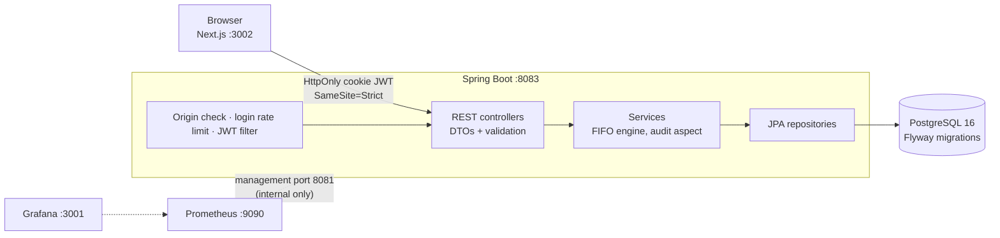

# Warehouse Management System (WMS)

[](https://github.com/eucardeveloper/inventory-management-api/actions/workflows/ci.yml) [](https://github.com/eucardeveloper/inventory-management-api/actions/workflows/frontend.yml)

Inventory management for a warehouse: products, suppliers, FIFO stock lots, stock movements, reports and an audit log. Spring Boot REST API, PostgreSQL, a Next.js dashboard, and Prometheus/Grafana monitoring. Runs locally with one command.

## Architecture



Design decisions are recorded in `docs/adr/` (monolith over microservices, FIFO engine, HttpOnly cookie JWT, pessimistic locking, append-only ledger).

| Layer | Technology |
|-------|-----------|
| Backend | Java 21, Spring Boot 3.5, Spring Security, JPA, Flyway |
| Frontend | Next.js 16, TypeScript, Tailwind CSS |
| Database | PostgreSQL 16 |
| Observability | Actuator, Micrometer, Prometheus, Grafana |
| Quality | JUnit 5, Testcontainers (PostgreSQL), ArchUnit, JaCoCo, OWASP dependency check, GitHub Actions |

## Run it locally

Requirements: Docker Desktop.

```bash
git clone https://github.com/eucardeveloper/inventory-management-api.git
cd inventory-management-api
docker compose up --build
```

The first build takes a few minutes.

| What | URL |
|------|-----|
| WMS app | http://localhost:3002 |
| API | http://localhost:8083 |
| Swagger UI | http://localhost:8083/swagger-ui.html |
| Prometheus | http://localhost:9090 |
| Grafana | http://localhost:3001 (admin / admin, demo only) |

Actuator runs on a separate management port (8081) that is reachable only inside the Docker network, so metrics and health details are never on the public API port.

### Your data survives restarts

Database data lives in a named Docker volume. `docker compose up -d` after a reboot or after `docker compose stop` / `down` brings everything back with all records intact; containers also restart automatically (`restart: unless-stopped`). The only command that deletes the data is `docker compose down -v` (or `docker volume rm`), so do not use `-v` unless you want a clean slate.

### Demo accounts

| Username | Password | Role |
|----------|----------|------|
| `admin` | `admin123` | ADMIN |
| `warehouse` | `warehouse123` | WAREHOUSE_MANAGER |
| `staff` | `staff123` | STAFF |

Demo users, products, lots and movements come from `src/main/resources/db/demo`, which only the `local` profile and the compose file add to Flyway. A real deployment uses `db/migration` only and has no seeded accounts; create the first admin out of band.

## Roles

| Area | ADMIN | WAREHOUSE_MANAGER | STAFF |
|------|-------|-------------------|-------|
| Dashboard, products, movements (read) | yes | yes | yes |
| Create/update products, record movements | yes | yes | no |
| Suppliers, reports | yes | yes | no |
| Audit log, user management | yes | no | no |

Roles are enforced in the API on every request. The Next.js middleware only improves navigation.

## Inventory model

- Stock is never edited directly: `product.stock` is read-only for clients and always equals the sum of `lot.remaining_quantity`. Receipts create lots, issues consume lots FIFO.
- Concurrent issues on the same product take a pessimistic lock (`SELECT ... FOR UPDATE`), see ADR-004.
- The database enforces the invariants too: `CHECK` constraints for non-negative stock and for `0 <= remaining_quantity <= quantity`.
- Every movement is an append-only ledger row with a running `stock_after`.
- Product and supplier endpoints use request/response DTOs, so entities and internal fields are not exposed and unknown JSON fields are ignored.

## Security model

- **Auth**: JWT in an `HttpOnly`, `SameSite=Strict` cookie, `Secure` by default (an explicit property turns it off for plain-HTTP localhost). JavaScript cannot read the token.
- **CSRF**: stateless JWT does not remove CSRF risk when the browser sends the token automatically. Protection is layered: `SameSite=Strict`, an `Origin`/`Referer` check on state-changing requests against `app.cors.allowed-origins`, and JSON-only bodies.
- **Endpoints**: every `/api/**` route needs a valid token and the right role; anonymous calls get `401`, a valid token with too weak a role gets `403`. `POST /api/auth/register` (create an account with any role) is ADMIN only, and a token stops working as soon as its user is deleted. `ApiAuthorizationTest` calls every route without token, with a forged token and as STAFF.
- **Brute force**: login and register are limited to 10 attempts per minute per client address (in memory, per instance).
- **Secrets**: no signing key or DB password is hard-coded in the application. The app refuses to start with a missing or short `JWT_SECRET` (< 32 bytes). The `local` profile and the compose file carry clearly marked development values.
- **Errors**: optimistic/pessimistic lock failures and constraint violations map to `409`, not `500`.
- **Dependencies**: OWASP dependency check runs weekly in CI.

For anything beyond a local demo, set `JWT_SECRET` and `GRAFANA_PASSWORD` in a `.env` file.

## Tests

```bash
./mvnw verify          # unit + integration tests, JaCoCo report in target/site/jacoco
```

Integration tests use Testcontainers and need Docker. They include a concurrency test for the FIFO lock and a stock-invariant test that applies 200 random movements to a real PostgreSQL and checks `stock = sum(lots)` and the CHECK constraints. CI uploads the JaCoCo report as an artifact.

Frontend:

```bash
cd frontend/warehouse-app && npm ci && npm run lint && npm run build
```

## API summary

```
POST   /api/auth/login | /logout | /refresh      (public)
POST   /api/auth/register                       (ADMIN only)
GET    /api/products              POST /api/products        PUT /api/products/{id}
GET    /api/movements             POST /api/movements
GET    /api/suppliers             POST /api/suppliers       PUT /api/suppliers/{id}
GET    /api/reports/...           (PDF, XLSX, CSV exports, FIFO cost report)
GET    /api/audit                 (ADMIN)
GET    /api/users                 (ADMIN)
```

Full request/response schemas are in Swagger UI.

## Known limitations

- Spring Boot 3.5 reached the end of open-source support on 2026-06-30; the planned next step is the Spring Boot 4 migration on its own branch.
- `WmsApp.tsx` is a large single component; splitting it by feature and adding browser tests are the next frontend tasks.
- The login rate limiter is per process; several instances would need a shared store.
- Running the Java build and the compose stack requires Maven Central and Docker Hub access.

## License

MIT
